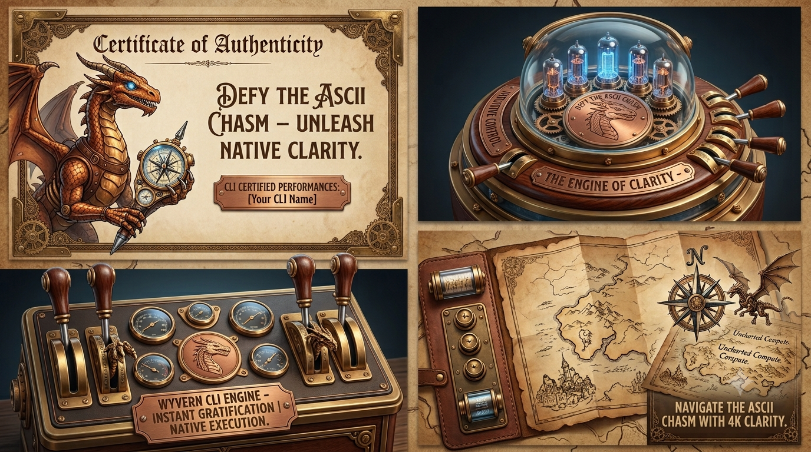

# Wyvern

**What You View, Engine Renders Natively**



> A lightweight CLI tool that opens native webview windows for user interaction and returns structured JSON results — with zero browser dependency and full MCP compatibility.

---

## What it does

Wyvern bridges the gap between CLI tools and rich user interaction. Pass it a JSON command, get back a JSON result. No Electron. No Chrome. Just the OS's built-in webview rendering your HTML.

The MVP API stays intentionally small:
- Blocking dialog commands: `message`, `input`, `markdown`, `question`, `wizard`
- `--interactive` lifecycle actions: `show`, `hide`, `exit`

If something feels complicated, it is usually a documentation or scope problem, not a signal to grow the API. Reviews and hardening should attack accidental complexity directly.

```bash
# Show a dialog
wyvern '{"type": "message", "title": "Deploy?", "message": "Push to production?", "buttons": "yes_no"}'
# → {"button": "yes"}

# Collect input
wyvern '{"type": "input", "title": "Branch name", "message": "Enter the branch to deploy:"}'
# → {"button": "ok", "input": "feature/my-branch"}

# Render a markdown doc
wyvern my-doc.md

# Run a multi-page wizard
wyvern '{"type": "wizard", "page": {"id": "start", "title": "Setup", "html": "wizards/setup.html"}, "config": {}}'
```

---

## Why Wyvern

| | Wyvern | Electron | OS dialogs |
|---|---|---|---|
| Bundle size | ~5MB | ~150MB | 0 |
| HTML/CSS/JS UI | ✅ | ✅ | ❌ |
| No browser required | ✅ | ❌ | ✅ |
| Custom wizards | ✅ | ✅ | ❌ |
| MCP-compatible | ✅ | ❌ | ❌ |
| JSON I/O | ✅ | custom | ❌ |

---

## Dialog types

- **`message`** — blocking modal with title, body, icon, and standard button combos (`ok`, `yes_no`, `ok_cancel`, `yes_no_cancel`, `retry_cancel`, or custom)
- **`input`** — text entry, multiline, or file/folder chooser
- **`markdown`** — styled markdown viewer (`file`, inline `content`, or `wyvern file.md` shorthand)
- **`wizard`** — multi-page wizard with browser-history navigation, driven by page descriptors plus your HTML + JSON config
- **`question`** — blocking native renderer based on Claude's public `AskUserQuestion` API

---

## Interactive mode

Wyvern can run as a persistent process, accepting a stream of JSON commands over stdin:

```bash
wyvern --interactive
```

`--interactive` is still a sequential loop. Blocking dialog commands keep their normal modal behavior inside that loop; `show`, `hide`, and `exit` are the only non-dialog commands and are valid only inside that persistent stdin loop.

Claude Code and other agents can drive it from a background shell process with no MCP required.

---

## MCP

Wyvern's JSON schema maps 1:1 to MCP tool parameters. Run it as an MCP server and the same blocking dialog commands become tool calls — with a persistent window that survives across calls. In MVP, lifecycle actions are part of `--interactive`, not public MCP tools.

```bash
wyvern --mcp
```

---

## Platform support

| Platform | Engine | Load time | Memory |
|----------|--------|-----------|--------|
| macOS | WebKit (system) | ~instant | ~30–50MB |
| Windows | WebView2 | fast | ~40–60MB |
| Linux | WebKitGTK | moderate | ~100–150MB |

---

## Docs

- [PRD](docs/prd/wyvern-prd.md) — full product requirements and JSON schema reference

## Deferred

- `notification` is intentionally deferred. It is the future fire-and-forget path for ephemeral updates; MVP keeps `message` strictly blocking.

---

*Wyvern: Defy the digital chasm. Unleash native clarity.*
