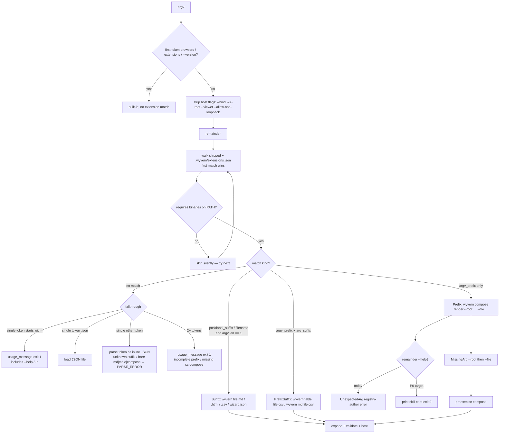

# Phase F CLI extensions — critical agent-usability review

**Date:** 2026-08-15
**Worktree:** `integrate/phase-F` (`fbc665a` and parents f.1–f.4)
**Stance:** AI agent is the primary user. The agent has **zero** prior documentation — only what the binary exposes (`wyvern --help` / bare invocation, `wyvern extensions list`, stderr). README is scored separately and must not be required.
**Method:** Source review of `usage_message()`, dispatch, registry, list formatter, and emit helpers, plus live transcripts from `./target/debug/wyvern` on this worktree. Rubric informed by reviewing-ai-clis (typed/actionable errors) and agent-ergonomics axioms 0/6/7/9 (first-try inevitability, error-teaches, intent inference, in-tool contract).

---

## Executive verdict

Phase F’s extension engine is a solid **argv preprocessor** (match → optional preexec → expand → existing `Command` JSON), and `wyvern extensions list` is the one surface that almost makes the shipped pack discoverable. An agent that already knows to run that command can reconstruct six of seven invocations from match-kind strings (`suffix: .csv`, `prefix+suffix: md .csv`, `filename: wizard.json`). Everything around that catalog fails the no-docs bar. `--help` still describes a JSON/markdown/html/wizard.json tool and never names `.csv`, `table`, `md`, or `compose render`. Near-misses (`wyvern notes.txt`, `wyvern md`, `wyvern compose`, missing `python3` / `sc-compose`) fall through to “not valid JSON” or a generic usage dump with **no** “did you mean” and **no** install hint. `wyvern compose render --help` is treated as an undeclared registry flag, not help. `extensions list` has no examples, required flags, expand type, or availability bit, and silently ignores `--json`. Preexec failures leak child stderr in front of the JSON envelope and then tell the agent to “install binaries” even when the binary ran and the file was missing. Compose is worse: the shipped preexec passes `--out` / `--format` / `--env` to a current `sc-compose` that wants `--output` and `--env-prefix`, so the one prefix skill that needs flags is not actually invocable after the agent discovers it. **The registry is a skills pack in all but name, but the CLI does not speak skill.** Until help, list, and errors dump the contract the JSON already has, a cold agent will burn turns on parse errors and docs paths it does not have.

---

## Agent-usability score (1–5)

**Score: 2 / 5** — catalog exists; first-try recovery does not.

| Score | Meaning (this review’s rubric) |
|------:|--------------------------------|
| 5 | Every shipped invocation **and** its required flags are reconstructable from `--help` + list + one error; failures name a copy-pasteable next command; list is JSON. |
| 4 | All invocations reconstructable from list; flags appear in the first error; `--help` lists every skill with an example; missing-requires says “install X”. |
| 3 | Suffix invocations work first-try when deps are present; list match-kinds are enough for `table` / `md`; compose flags and failure modes still need trial-and-error. |
| **2** | **`--help` points at `extensions list`; list is a cryptic id/kind/requires dump; common near-misses return JSON-parse or generic usage; compose `--help` is an author-facing registry error.** |
| 1 | No extension surface at all; agent must read README or plan docs. |

**Why not 3:** suffix happy paths (`wyvern file.md`, `wyvern file.csv` with `python3` on `PATH`) *do* satisfy first-try inevitability — but the review question is whether an agent can **infer all invocations and recover from failures with only CLI output**. `--help` omits half the pack; missing-requires and unknown suffixes lie (“not valid JSON”); compose help does not exist; list cannot be parsed as a skill card.

**README (docs assumed available) — 3 / 5, scored separately.** README quick examples cover `doc.md`, `page.html`, `wizard.json`, and `compose render --root/--file`. They omit `.csv`, `table`, `md <file.csv>`, and `wyvern extensions list`. An agent that *does* read README still cannot discover the CSV pack or the catalog command.

---

## Review questions

### 1. Agent discoverability (no docs)

**Partial, and only if the agent guesses `extensions list`.**

From `--help` alone the agent learns: JSON / `.json` / `.md` / `.html` / `wizard.json`, `browsers`, `extensions list`, host flags. It does **not** learn `.csv`, `wyvern table`, `wyvern md`, or `wyvern compose render`.

From `extensions list` alone a careful agent can reconstruct:

| List line | Inferred invocation | Inferred behavior |
|-----------|---------------------|-------------------|
| `markdown-suffix  suffix: .md` | `wyvern file.md` | unknown (markdown? wizard?) |
| `html-suffix  suffix: .html` | `wyvern page.html` | unknown |
| `wizard-json-suffix  filename: wizard.json` | `wyvern …/wizard.json` | unknown |
| `compose-render  prefix: compose render  (requires: sc-compose)` | `wyvern compose render …` | **flags unknown** |
| `csv-suffix  suffix: .csv  (requires: python3)` | `wyvern file.csv` | unknown |
| `csv-table-alias  prefix+suffix: table .csv` | `wyvern table file.csv` | unknown vs suffix |
| `csv-md  prefix+suffix: md .csv` | `wyvern md file.csv` | unknown vs `file.md` |

**Missing from CLI surfaces:**

- Required compose flags (`--root`, `--file`) and optional repeats (`--var`, `--var-file`, `--env`)
- What each skill *does* (dialog type, HTML table vs markdown)
- That `table` is an alias of `csv-suffix`, not a different viewer
- That `md file.csv` ≠ `file.md` (CSV→markdown vs open a markdown file)
- That `requires` means “hidden at match time” (fallthrough), not “error if missing”
- That `wizard.json` is exact basename, not `*.json`
- That `--ui-root` is auto-inferred for html/wizard and **overridden** by the extension
- A dump of the registry JSON or a `--json` list
- Any `extensions show <id>` / `help` subcommand

### 2. Extension list quality

**Insufficient as a skill index.** Present: `id`, match-kind summary, `requires` names. Absent: description, example argv, declared `{arg:*}`, expand `type`, available-vs-skipped, `extends`, JSON mode.

`format_extensions_list` (`crates/wyvern/src/extensions/list.rs`) prints one line per entry. Extra tokens are ignored: `wyvern extensions list --json` prints the same prose (exit 0). `wyvern extensions --help` and `wyvern extensions show compose-render` are “unknown subcommand” with only `Usage: wyvern extensions list`.

List always shows requires-gated entries (good). It never says whether the binary is on `PATH` *right now* (bad). An agent cannot tell “I can run this” from “this is advertised but will silently not match.”

### 3. Error messages

**Structured JSON is a strength. Next-command guidance is not.**

| Invocation | Live result | Guides the agent? |
|------------|-------------|-------------------|
| `wyvern notes.txt` | `PARSE_ERROR` “expected ident… Input was not valid JSON” | **No.** File path treated as inline JSON. No “unknown suffix; run `wyvern extensions list`”. |
| `PATH=/bin wyvern sample.csv` (no `python3`) | same `PARSE_ERROR` | **No.** Hidden-when-missing looks like “CSV is not a thing.” |
| `wyvern md` / `wyvern table` / `wyvern compose` | `PARSE_ERROR` on the bare word | **No.** Prefix without the rest is not “usage: wyvern md &lt;file.csv&gt;”. |
| `wyvern md notes.txt` | generic `usage_message()` exit 1 | Weak. Mentions `extensions list` only as a see-also, not “`md` needs a `.csv`”. |
| `PATH` without `sc-compose`: `wyvern compose render --root /tmp --file page.j2` | generic usage exit 1 | **No.** Does not say “install `sc-compose`” even though list advertises it. |
| `wyvern compose render` | `VALIDATION_ERROR` missing `--root` + “Pass --root VALUE” | **Yes, one flag at a time.** Then missing `--file`. Never mentions `--var` / `--var-file` / `--env`. |
| `wyvern compose render --help` | `VALIDATION_ERROR` “unexpected argument… declare them as `{arg:name}` in the registry” | **No.** Author-facing. Docs pointer to `cli-extensions-contract.md`. |
| Missing CSV file (python3 present) | Child line `csv_to_view: could not read CSV…` then JSON `IO_ERROR` “'python3' exited with exit status: 1”, recovery “Install binaries listed in preexec.requires” | **Wrong recovery.** File is missing; binary ran. Stderr is not parseable JSON. |
| `wyvern compose render --root /tmp --file missing.j2` | `sc-compose` clap: unexpected `--out`, tip `--output`; then same “install binaries” JSON | **Blocks the skill.** Agent is sent to install a binary that is already installed. |

`--bind` invalid values *do* include a Recovery block and reprint usage — that pattern is not reused for extension near-misses.

### 4. Subcommand vs suffix confusion

**Not discoverable from `--help`. Reconstructable from list if the agent can read the DSL.**

- `wyvern file.csv` and `wyvern table file.csv` are the same skill (`csv-table-alias` `extends` `csv-suffix`). List does not say “alias” or “same as suffix.”
- `wyvern md file.csv` is a **different** skill (markdown capture), easily confused with `wyvern file.md`.
- `wyvern compose render` is prefix-only; `wyvern compose` and `wyvern compose --help` do not match and do not teach the two-token prefix.

An agent that tries `wyvern table file.csv` because it saw `table` in some other CLI will succeed *if* `python3` is present — but it will not learn that from help.

### 5. Help gaps

Absent from `usage_message()` / `--help` (agents need all of these):

- `.csv` / `table` / `md <file.csv>`
- `compose render --root <dir> --file <tmpl> [--var k=v] [--var-file f] [--env …]`
- What `--ui-root` actually does for wizards (auto-inferred `{wizard_root}`; extension override wins)
- `wizard.json` exact-basename rule
- `WYVERN_VIEWER` / `WYVERN_UI_ROOT` / `WYVERN_SHARE` (only `WYVERN_VIEWER=none` is hinted)
- Exit-code dictionary
- `extensions list` examples; `--json`; `extensions show`
- That `--help` / `-h` are not first-class (they fall into “starts with `-` → usage”, **exit 1**)
- `wyvern help` is `PARSE_ERROR`

f.2’s sprint note (“`--help` examples” for `.html` / `wizard.json`) landed as two tokens in the usage line, not a worked example block.

### 6. Skills metaphor

**The registry is already a declarative skills pack. The CLI does not present it as one.**

`share/wyvern/extensions.json` is agent-legible **if the agent finds the file**: `id`, `match`, `requires`, `extends`, `preexec.args` with `{arg:root}` / `{arg:file}` / `{arg:var:repeat}`, and `expand.command.type`. That is a skill card (trigger, deps, input flags, output dialog type).

From shipped **CLI** artifacts alone, the contract is not legible:

- No `description`, `examples`, or `when_to_use` fields exist in the JSON schema
- `extensions list` does not dump match/expand/args
- The file path is mentioned only on `InvalidRegistry` recovery (`share/wyvern/extensions.json` / `.wyvern/extensions.json`), not in `--help`
- Embedded `SHIPPED_EXTENSIONS_JSON` is not printable (`wyvern extensions dump` does not exist)
- Docs pointers (`docs/plans/phase-F/…`) assume a git checkout

Rename is optional; **dumping the skill card is not.** `wyvern extensions list --json` (or `wyvern skills`) should emit the same fields an agent would otherwise reverse-engineer from the JSON file.

---

## Help system audit

| Surface | Present? | Gap | Recommendation |
|---------|----------|-----|----------------|
| Bare `wyvern` (TTY) | Yes — prints usage, exit 1 | Help is an error; no examples; no CSV/compose | Treat as help: exit 0; add Examples + Extensions block |
| `wyvern --help` / `-h` | Accidental — unknown flag starting with `-` → usage, exit 1 | Not a real flag; not listed in Options; exit 1 | First-class `--help`/`-h`, exit 0, same enriched text |
| `wyvern help` | No | `PARSE_ERROR` “not valid JSON” | Alias to usage; never parse the word `help` as JSON |
| `wyvern --version` | Yes | Fine | Keep |
| Usage “file types” line | Partial | Names `.md` `.html` `wizard.json`; omits `.csv` | List every shipped suffix and the compose/md/table prefixes |
| Host flags in usage | Yes | `--ui-root` described as “packaged UI root”; no wizard-root / override rule | One line: html/wizard infer ui-root; extension `host.ui_root` wins |
| `WYVERN_VIEWER` | Hint only | Other env vars invisible | List `WYVERN_VIEWER`, `WYVERN_UI_ROOT`, `WYVERN_SHARE` |
| `wyvern extensions` | Defaults to `list` | Good instinct | Keep; add `--help` on the family |
| `wyvern extensions list` | Yes | id / kind / requires only | Add example, args, type, available/skipped |
| `wyvern extensions list --json` | Silently ignored | Agents expect JSON | Implement or error “unknown flag; try … --json” |
| `wyvern extensions --help` | No | `unknown extensions subcommand '--help'` | Print list + show + dump usage |
| `wyvern extensions show <id>` | No | Cannot inspect one skill | Dump match, requires, args, example, expand type |
| `wyvern compose render --help` | No | `UnexpectedArg` + registry-author recovery | If remainder is `--help`/`-h`, print that extension’s skill card |
| `wyvern browsers --help` | No | Same unknown-subcommand pattern | Same fix |
| Unknown suffix error | No dedicated path | Falls through to JSON parse | “Unknown input ‘notes.txt’. Supported: … Run `wyvern extensions list`.” |
| Missing `requires` | Hidden skip | Looks like unknown command / not JSON | “csv-suffix skipped (python3 not on PATH). Install python3, or …” |
| `MissingArg` | Yes, sequential | One flag per failure; optional flags never listed | List **all** declared `{arg:*}` and an example line |
| `UnexpectedArg` | Yes | Recovery is “declare `{arg:name}` in the registry” | “Unknown flag --help. compose-render accepts: --root --file [--var] …” |
| Preexec failure | Partial JSON | Child stderr inherited; recovery always “install binaries” | Capture child stderr into envelope; branch spawn-fail vs exit-nonzero vs missing file |
| Docs pointers in stderr | Yes | `docs/plans/phase-F/…` and schema REQ ids | Point at in-binary commands first (`wyvern extensions list`, `wyvern --help`) |
| README Phase F quickstart | Partial (docs) | No CSV / table / md / `extensions list` | Add those four lines (human/docs track only) |

---

## Concrete recommendations

### P0

1. **Put every shipped skill on `--help` with a copy-paste example**
   - **Where:** `usage_message()` in `crates/wyvern/src/cli_args.rs`; make `--help`/`-h` a real early-return in `main.rs` (exit 0).
   - **Example text:**
     ```
     Extensions (see `wyvern extensions list`):
       wyvern doc.md
       wyvern page.html
       wyvern path/to/wizard.json
       wyvern data.csv
       wyvern table data.csv          # same interactive table as data.csv
       wyvern md data.csv             # CSV as a markdown dialog
       wyvern compose render --root DIR --file FILE.j2 [--var k=v] [--var-file vars.json]
     ```
   - **Why:** Axiom 0. Today `--help` hides the CSV and compose packs. Agents that stop at help never discover them.

2. **Stop lying on near-misses: unknown suffix, incomplete prefix, and skipped `requires` must name the skill**
   - **Where:** `load_command_input` fallthrough in `main.rs` / `input.rs`; `match_argv` should return a *skipped* reason, not only `None`.
   - **Example text:**
     ```
     wyvern: no extension matched 'sample.csv'
       csv-suffix (suffix: .csv) was skipped because python3 is not on PATH
       Install python3, then: wyvern sample.csv
       Also: wyvern table sample.csv   |   wyvern md sample.csv
       Catalog: wyvern extensions list
     ```
     For `wyvern compose` / `wyvern md`:
     ```
     wyvern: 'md' looks like extension csv-md (prefix+suffix: md .csv)
       Usage: wyvern md <file.csv>
     ```
     For `wyvern notes.txt`:
     ```
     wyvern: unknown input 'notes.txt' (not JSON, not a known suffix)
       Supported files: .md .html .csv wizard.json
       Catalog: wyvern extensions list
     ```
   - **Why:** Live `PATH=/bin wyvern sample.csv` and `wyvern notes.txt` both return `PARSE_ERROR` “Input was not valid JSON.” That teaches the agent the wrong world model.

3. **Make `extensions list` a skill index (text + `--json`)**
   - **Where:** `crates/wyvern/src/extensions/list.rs`; add optional fields to `extensions.json` (`description`, `examples`) *or* derive examples from match + `declared_args()`.
   - **Example text (text mode):**
     ```
     csv-md
       match:    prefix+suffix  wyvern md <file.csv>
       requires: python3        [available]
       expands:  markdown
       example:  wyvern md fixtures/sample.csv
     compose-render
       match:    prefix  wyvern compose render --root DIR --file FILE [--var k=v] [--var-file F] [--env P]
       requires: sc-compose     [missing]
       expands:  wizard
       example:  wyvern compose render --root ./templates --file page.j2
     ```
   - **Example `--json` shape:** `{ "id", "match", "invocation", "requires", "available", "args": [{"name","required","repeat"}], "expands_to", "examples" }`
   - **Why:** List is the only catalog. Right now it cannot answer “what do I type?” or “will it match on this machine?” `list --json` today silently ignores `--json`.

4. **`--help` after an extension prefix must print that skill’s card, not `UnexpectedArg`**
   - **Where:** `parse_named_args` / `expand_and_validate` in `crates/wyvern/src/extensions/expand.rs`; special-case `--help`/`-h` before declared-arg checks.
   - **Example text:**
     ```
     Usage: wyvern compose render --root <DIR> --file <FILE> [--var k=v] [--var-file F] [--env P]
     Requires: sc-compose
     Expands to: wizard preview of rendered HTML
     Example: wyvern compose render --root fixtures/compose-minimal --file page.j2
     ```
   - **Why:** Live `wyvern compose render --help` is `VALIDATION_ERROR` “declare them as `{arg:name}` in the registry.” Agents treat `--help` as the contract. This is the opposite of Error-Teaches.

5. **Fix compose preexec to match real `sc-compose`, and stop saying “install binaries” when the binary ran**
   - **Where:** `share/wyvern/extensions.json` `compose-render.preexec.args`; `emit_extension_error` / `run_preexec` in `error.rs` + `preexec.rs`.
   - **Change:** current `sc-compose render` accepts `--output` (not `--out`), has no `--format html`, and uses `--env-prefix` (not `--env`). Live failure:
     `error: unexpected argument '--out' found` / tip `--output`, then Wyvern JSON recovery “Install binaries listed in preexec.requires”.
   - **Error example after fix:**
     ```
     {"error":"io","code":"IO_ERROR","message":"sc-compose exited 3: unexpected argument '--out'",
      "recovery":["The compose-render preexec argv is stale vs sc-compose",
                  "Run: sc-compose render --help",
                  "Wyvern should pass --output DIR, not --out"]}
     ```
   - **Why:** Discoverability is useless if the discovered command cannot run. Child stderr is inherited (`Stdio::inherit()`), so JSON on stderr is preceded by clap prose — agents cannot parse it.

### P1

6. **`MissingArg` should list every declared flag in one shot**
   - **Where:** `ExtensionError::MissingArg` emit in `error.rs`; `declared_args()` already exists in `expand.rs`.
   - **Example:** `missing --root. compose-render requires --root DIR --file FILE; optional --var (repeat), --var-file (repeat), --env (repeat). Example: wyvern compose render --root ./t --file page.j2`
   - **Why:** Today the agent learns `--root`, reruns, learns `--file`, and never learns optional repeats without reading JSON.

7. **`UnexpectedArg` recovery must be caller-facing, not registry-author-facing**
   - **Where:** `emit_extension_error` `UnexpectedArg` arm.
   - **Example:** `unknown flag '--help'. compose-render accepts: --root --file --var --var-file --env. Try: wyvern compose render --help`
   - **Why:** “declare them as `{arg:name}` in the registry” is for extension authors. Agents are callers.

8. **Preexec: capture child stderr into the JSON envelope; classify spawn vs nonzero vs timeout**
   - **Where:** `preexec.rs` (`stderr(Stdio::inherit())` → pipe + attach); `ExtensionError::Preexec`.
   - **Why:** Axiom 4 (stdout data / stderr diagnostics) and reviewing-ai-clis (structured details). “Install binaries” is only correct on spawn `ENOENT`.

9. **First-class help exit 0; `wyvern help` / `wyvern extensions --help` / `wyvern browsers --help`**
   - **Where:** `main.rs` early argv; `list.rs`; `browsers_cmd.rs`.
   - **Why:** Help as exit 1 and `wyvern help` as parse error are anti-patterns agents hit on day zero.

10. **Document `--ui-root` / wizard-root on the help surface**
    - **Where:** `usage_message()` Options block.
    - **Example:** `--ui-root PATH  Override packaged UI. For .html / wizard.json, ui-root is inferred (dir with wizard.json or pages/). An extension host.ui_root replaces this flag.`
    - **Why:** Agents will pass `--ui-root` and not understand why html/wizard ignore it (contract §7).

11. **Add `description` + `examples` to the registry schema (skills contract)**
    - **Where:** `share/wyvern/extensions.json` + `ExtensionDef` in `extensions/mod.rs`.
    - **Why:** The JSON is the skill. Without prose fields, even `extensions show` has to invent meaning from `expand.command.type`.

12. **README quickstart: add CSV + catalog (docs track)**
    - **Where:** `README.md` “Quick examples” / “Optional: Compose render”.
    - **Example:** `wyvern fixtures/sample.csv`, `wyvern md fixtures/sample.csv`, `wyvern extensions list`.
    - **Why:** Even humans/docs-reading agents cannot find CSV today. Does not replace P0 in-binary help.

### P2

13. **`wyvern extensions dump` (or `list --raw`) prints merged registry JSON** so agents can read the contract without finding `share/wyvern/extensions.json`.
14. **Availability column / `--available` filter** on list; default text should mark `[missing: sc-compose]`.
15. **Exit-code dictionary** on `--help` (usage=1, parse=2, io=3, validation=4, …) — codes exist in `ErrorCode` but are invisible.
16. **Typo / intent inference** for `wyvern compsoe`, `wyvern --json`, `wyvern wizard.json.bak`.
17. **Optional `wyvern skills` alias** of `extensions` if the product wants the metaphor in argv, not only in docs.
18. **Do not point recovery at checkout-only paths** (`docs/plans/phase-F/cli-extensions-contract.md`) as the first recovery step; those files are absent from a release tarball.

---

## “Day zero” agent playbook

Minimal steps a cold agent can follow **using only CLI output as it exists today**, including the dead ends.

```text
1. wyvern
   → usage (exit 1). Note: JSON, .md, .html, wizard.json, `extensions list`.
   CSV / table / md / compose are not mentioned.

2. wyvern --help
   → same usage (exit 1). Same gaps.

3. wyvern extensions list
   → seven lines. Reconstruct:
        wyvern FILE.md | FILE.html | …/wizard.json | FILE.csv
        wyvern table FILE.csv
        wyvern md FILE.csv
        wyvern compose render   (flags still unknown)

4. wyvern compose render --help
   → DEAD END. VALIDATION_ERROR unexpected --help; “declare {arg:name}”.
   Do not treat this as “compose is broken”; drop --help.

5. wyvern compose render
   → missing --root. Add --root DIR.

6. wyvern compose render --root DIR
   → missing --file. Add --file FILE.

7. wyvern compose render --root DIR --file FILE
   → if sc-compose missing: generic usage (looks like step 1). Re-check list “(requires: sc-compose)”.
   → if sc-compose present (current binary): sc-compose rejects --out / --format.
     There is no CLI-only recovery. The agent must read share/wyvern/extensions.json
     and sc-compose render --help (external tool).

8. wyvern notes.txt  /  wyvern md  /  wyvern compose
   → PARSE_ERROR “not valid JSON”. Ignore the JSON advice.
   Re-run step 3 and match suffixes/prefixes.

9. wyvern FILE.csv with no python3
   → same PARSE_ERROR as step 8. Infer from list requires: install python3.

10. Do not expect `extensions list --json` or `extensions show`.
    To learn optional compose flags, read share/wyvern/extensions.json
    ({arg:var:repeat}, {arg:var-file:repeat}, {arg:env:repeat}) — not exposed by the CLI.
```

**After P0–P1, the playbook collapses to:** `wyvern --help` → pick example → on failure the error names the exact next argv.

---

## Argv → extension match



---

## Evidence appendix (live transcripts)

Recorded 2026-08-15 from `./target/debug/wyvern` in this worktree. `python3` and `sc-compose` were on the default `PATH` unless noted.

**`--help` (exit 1):**

```
Usage: wyvern '<json>' | <file.json> | <file.md> | <page.html> | wizard.json [options]
       echo '<json>' | wyvern [options]
       wyvern browsers list|refresh
       wyvern extensions list
       wyvern --version
…
  See `wyvern extensions list` for available file-type extensions.
  See also: docs/plans/phase-F/README.md
```

**`extensions list`:**

```
markdown-suffix  suffix: .md
html-suffix  suffix: .html
wizard-json-suffix  filename: wizard.json
compose-render  prefix: compose render  (requires: sc-compose)
csv-suffix  suffix: .csv  (requires: python3)
csv-table-alias  prefix+suffix: table .csv  (requires: python3)
csv-md  prefix+suffix: md .csv  (requires: python3)
```

**Near-misses:**

```
$ wyvern notes.txt
{"error":"parse","code":"PARSE_ERROR","message":"expected ident at line 1 column 2",
 "cause":"Input was not valid JSON",
 "recovery":["Ensure input is valid JSON", …]}

$ PATH=/bin wyvern sample.csv
{"error":"parse","code":"PARSE_ERROR","message":"expected value at line 1 column 1",
 "cause":"Input was not valid JSON", …}

$ wyvern compose render --help
{"error":"validation","code":"VALIDATION_ERROR",
 "message":"unexpected argument after extension match: --help",
 "recovery":["Remove unknown flags or declare them as {arg:name} in the registry"],
 "docs":"docs/plans/phase-F/cli-extensions-contract.md"}

$ wyvern compose render
{"error":"validation","code":"VALIDATION_ERROR",
 "message":"missing required extension argument --root",
 "recovery":["Pass --root VALUE after the extension prefix",
             "Run wyvern extensions list to see match kinds"]}

$ wyvern compose render --root /tmp --file missing.j2
error: unexpected argument '--out' found
  tip: a similar argument exists: '--output'
Usage: sc-compose render --root <ROOT> --file <FILE> --output <OUTPUT>
{"error":"io","code":"IO_ERROR","message":"'sc-compose' exited with exit status: 3",
 "recovery":["Install binaries listed in preexec.requires", …]}
```

**Source anchors:**

- `crates/wyvern/src/cli_args.rs` — `usage_message()`
- `crates/wyvern/src/main.rs` — built-ins, match, fallthrough
- `crates/wyvern/src/input.rs` — `.json` vs parse-as-JSON
- `crates/wyvern/src/extensions/mod.rs` — `match_argv` requires-skip, `match_kind_summary`
- `crates/wyvern/src/extensions/list.rs` — list formatter; unknown subcommand
- `crates/wyvern/src/extensions/expand.rs` — `declared_args`, `MissingArg` / `UnexpectedArg`
- `crates/wyvern/src/extensions/preexec.rs` — `stderr(Stdio::inherit())`
- `crates/wyvern/src/error.rs` — emit recovery strings
- `share/wyvern/extensions.json` — shipped skills
